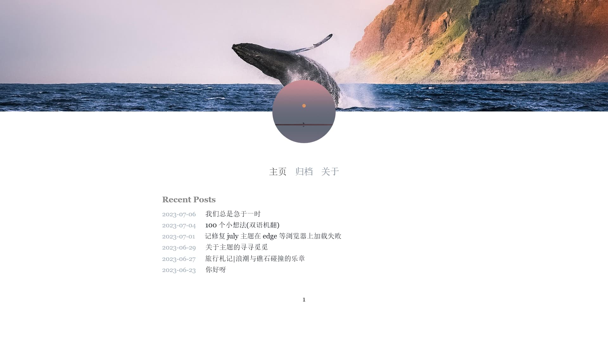

# July-Q

### 魔改自 [July](https://github.com/wisp-x/hexo-theme-july)。

---

<center></center>

### ~~暂时不建议更新 Hexo 至7.0版本，会导致代码块样式不适配！！！~~

魔改内容
--------

1. 增加 waline 评论系统
2. 修改超链接色彩
3. 增加链接色彩
4. 增加文章底部导航栏
5. 修改主页文章排列样式
6. 增加文章表头作者和分类等信息
7. 修改字体为思源宋体
8. 去除图片阴影
9. 修改引用和代码块样式
10. 修复在其他浏览器中CSS文件加载失败的问题
11. 去掉了banner头图
12. 添加主页作者标签和格言

Install
-------

```
$ git clone https://github.com/Jamyein/july-q.git themes/july
```

Enable
------

Modify theme setting in _config.yml to july-q

```
...
theme: july-q
...
```

Disable
-------

The july theme has a built-in highlight plug-in. In order to avoid conflicts, you need to turn off the highlight of the system.

```
...
highlight:
  enable: false
...
```

Create Page
-----------

```
$ hexo new page about
```

Update
------

```
cd themes/july
git pull
```

Configuration
-------------

```
# html lang
language: zh-CN

# main menu navigation
menu:
  主页: /index.html
  归档: /archives/index.html
  关于: /about/index.html

site:
  banner: # banner map of website. (please annotation this line if you don't need it)
  avatar:  # head portrait. Url or local file.

# stylesheets loaded in the <head>
stylesheets:
  - /css/markdown.css
  - /css/july.css
  - /css/waline.css # if use waline,please delete the "#" to use the waline.css

# scripts loaded in the end of the body
scripts:
  - /js/jquery-3.7.0.min.js
  - /js/highlight.min.js
  - /js/transition.js
  # - /js/smooth-scroll.min.js

hljs:
  enable: true # true to enable the plugin
  line_number: false # add line_number in frontend or backend (not recommend, have bugs in special hexo version)
  trim_indent: backend # trim the indent of code block to prettify output. backend or front-end (recommend)
  copy_code: true # show copy code in caption.
  label:
    left: Code
    right: ':'
    copy: Copy Code

# atom: atom.xml # website feed.

favicon: /img/favicon.ico 

waline: 
  enable: true # true to enable the waline
  serverURL: # your waline server site
```

Licence
-------

MIT
